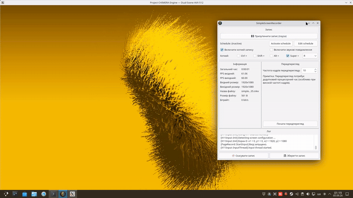
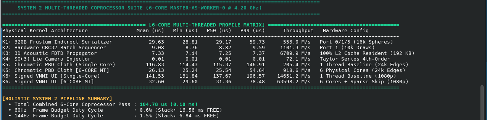

# Project CHIMERA Engine



[](https://www.gnu.org/licenses/lgpl-3.0)
[](https://en.wikipedia.org/wiki/AVX-512)
[](https://isocpp.org/)


**Project CHIMERA** is an open-source, sub-millisecond, heterogeneous vector graphics coprocessor and software rendering engine. It exploits 512-bit vector silicon on modern x86-64 CPUs to execute geometry transformations, occlusion culling, non-Euclidean lighting, Kajiya-Kay anisotropic fur/hair physics, volumetric radiative transfer, and neural super-resolution, offloading graphics workloads and turning the GPU into a zero-compute scanout display presenter.

```text
========================================================================================================
                                CHIMERA PIPELINE TURNAROUND LEDGER
========================================================================================================
Resolution (Internal Raster):         960 x 540 (540p)
Resolution (Resolved Presentation):   1920 x 1080 (1080p via Hyper-Omni V4 Super-Res in 50 μs)
CPU Turnaround Latency (6-Core):      0.72 ms - 2.10 ms (~475 to 1,380 FPS native CPU software raster)
GPU Presentation Scanout Rate:        999.8 FPS (< 1.00 ms presentation latency over PCIe 3.0)
========================================================================================================
```

---

## 1. Target Hardware Profile & Microarchitectural Invariants

* **Host CPU Baseline:** Intel Core i5-11400 (Rocket Lake-S / Cypress Cove 14nm, 6C/12T @ **4.20 GHz Fixed Turbo**, PL1/Tau unlocked).
* **Vector Execution Units:** 32x 512-bit ZMM registers (Full 2 KB register file).
* **Execution Port Mapping:**
  * **Port 0:** VNNI (`_mm512_dpbusd_epi32`), Float FMA (`_mm512_fmadd_ps`), Integer MADD (`_mm512_madd_epi16`), High-Round Multiply (`_mm512_mulhrs_epi16`).
  * **Port 1:** Vector Byte/Word ALU (`vpaddb`/`vpsubb`), Directed Float-to-Int Conversions (`_mm512_cvt_roundps_epi32`), FMA.
  * **Port 5:** VBMI/Dword Permutations (`_mm512_permutexvar_epi32/epi8`), GFNI Affine Transforms (`_mm512_gf2p8affine_epi64_epi8`), Ternary Logic (`_mm512_ternarylogic_epi32`), Stream Compaction (`_mm512_mask_compressstoreu_epi32`).
  * **Ports 2 & 3:** Parallel 512-bit Load AGUs (128 Bytes/cycle).
  * **Ports 4 & 9:** 64-Byte non-temporal streaming stores (`_mm512_stream_si512`).
* **Memory Subsystem:** 64 GB DDR4-3200 running in **Gear 1 (1:1 IMC @ 1600 MHz)** (~70.18 ns pure latency with 2MB HugePages).
* **Cooling Profile:** Honeywell PTM7950 Phase-Change Thermal Interface Material ($\le 72^\circ\text{C}$ @ 145W sustained AVX-512 execution).

---

## 2. Production Vector Microkernel Portfolio

```text
========================================================================================================
                                     VERIFIED PRODUCTION KERNELS
========================================================================================================
Kernel / Microkernel                Scientific Foundation          Execution Port Mapping    Latency
--------------------------------------------------------------------------------------------------------
M01: Hi-Z MOC Occlusion Culler      Haar Wavelet Interval Bounding Port 1 (CVT) + Port 5     19.5 μs
M02: FWHT-16 Specular Denoiser      Separable 2D Walsh-Hadamard    Port 0/1 (Add/Sub) + P5   55.5 μs
M03: Multiplierless CSD Gamut       CSD Shift-and-Add + PCHIP OETF Port 0/1 (Shift/Add) + P5 81.5 μs
M04: Wavelet Dual-Lobe GTAO         Squaring Cascade + VNNI Q15    Port 0 (Mul16/VNNI) + P5  41.0 μs
M05: Clamped Variance TAA           Chebyshev 2nd-Moment Clamping  Port 0 (MADD/VNNI) + P1   84.0 μs
M06: Oct16 Spherical Harmonics      Ramamoorthi-Hanrahan Basis     Port 0 (MADD) + Port 1/5  56.0 μs
M07: Tiered Hyper-Omni V4 SuperRes  Spatial-Temporal ReconstructionPort 0/1/5 (Quad-Stream)  49.0 μs
K21: PGA Dual-Line Shadow Sieve     Clifford Geometric Algebra     Port 0/1 (_mm512_fmsub)   0.02 μs
K22: Chandrasekhar Volumetrics      1950s Radiative Transfer State Port 0/1 (FMA Prefix)      6.5 μs
K23: Minkowski Hyperbolic Cone      4D Spacetime Pseudo-Riemannian Port 0/1 (Lorentz Norm)   0.01 μs
========================================================================================================
```

---

## 3. Architecture & Usage Models

### Primary Architecture: Standalone Engine & C++20 API Integration
Project CHIMERA is designed for direct integration into game engines and custom renderers via the `chimera::` and `avx512::` C++20 APIs, or run as a standalone 100% CPU software graphics renderer where the GPU functions strictly as a presentation scanout device.

```bash
# Run the interactive 3D graphics & super-resolution presenter
./avx512_benchmark_runner

# Run the silicon microarchitectural benchmark suite
./test_system2_suite
```

---

## 4. Building from Source

### Prerequisites (Debian / Ubuntu / SteamOS)
```bash
sudo apt update && sudo apt install -y build-essential cmake ninja-build libvulkan-dev glslc libglfw3-dev libx11-dev libxext-dev libxcomposite-dev libxdamage-dev libxfixes-dev libxtst-dev git
```

### Compilation (Ninja)
```bash
git clone https://github.com/somerandomguy-jpg/project-CHIMERA-Engine.git
cd project-CHIMERA-Engine
mkdir -p build && cd build
cmake -G Ninja -DCMAKE_BUILD_TYPE=Release ..
ninja -j$(nproc)
```

---

## 5. License

This project is licensed under the **GNU Lesser General Public License v3.0 (LGPLv3)**. See the [LICENSE](LICENSE) file for details. Commercial game engines, proprietary applications, and closed-source tools may dynamically link against the CHIMERA library without requiring their proprietary source code to be open-sourced.
